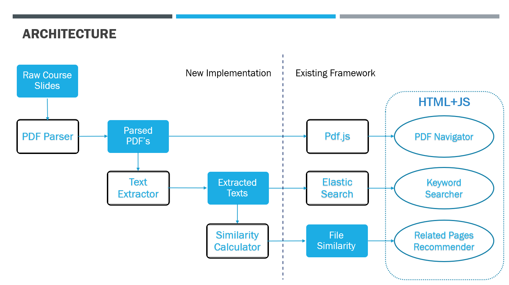

# EducationalWeb
###Introduction

This project derived from an open-source application provided by my another course: [EducationalWeb]（https://github.com/CS410Fall2020/EducationalWeb）. It provides functions to navigate slides, do keyword search and recommend related pages from sourced pdf documents, specifically course slides to help students learn and prepare for the exam:
1. Navigate presentation slides (PDF) by course and lecture name
2. Search key words in all the PDF slides and return ranked result of related pages
3. Recommend related slides that contains the similar topic based on current displayed slide
4. Explain* any word(s) selected in current slide in a machine learning composited paragraph from the text book or a corpus of documents (under development).

###New Implementaions
The existing framework only consumes final data. The following steps are newly implemented to be able to consume any course slides. The new code sits in the folder educational_web, and has its own main function.
1. *pdf_parser*: Source data of slides are downloaded from course website and saved on AWS S3 as ExternalTask.
The pdf_parser pull the raw slides from S3 and parse into single page files by PyPDF2. Those files are saved as Luigi TargetOuput in a course ~ lecture ~ page architecture.
Pdf.js is a JavaScript library that renders PDF files using web standards-compliance HTML5 Canvas. It consumes those the parsed slides and run a pdf viewer server at https:/localhost:8888.
2. *text_extracor*: Text_extractor relies on previous task and extracts text information from each parsed pdf with two steps:
Use textract package to extract a line of text string from each pdf file;
Use metapy package to create a tokenizer that processes the string to a list of words: length filtering, stop words filtering, stemming, etc.
The text string from each file is saved in a separate line, corresponding to its label at the same position in another file (both using atomic_write), which also links to the PDF viewer.
The two data files are then indexed and fed into ElasticSearch, which  is a distributed full-text search engine that provides an HTTP web interface.
3. *similarity_calculator*: Similarity_calculator consumes the extracted texts and calculates the relationship between each pair of documents based on their similarities
Those documents are converted to a data structures called Inverted Index that enable fast search (precomputing as much as we can)
Use BM25 to compute the relation with: Term frequency transformation and Inverted document frequency.
The top 10 related documents with normalized similarity are saved as Dask Dataframes CSVTarget. The related slides up to certain threshold will be recommended on the right side of currently viewing PDF page.

### Installation Instructions

To make this run on Windows, you need to first install:
1. Poppler: https://anaconda.org/conda-forge/poppler
2. Node.Js and NPM: https://phoenixnap.com/kb/install-node-js-npm-on-windows

The following instructions have been tested with Python2.7 on Linux and MacOS

1. You should have ElasticSearch installed, then go to the installed folder and run `./bin/elasticsearch` https://www.elastic.co/guide/en/elasticsearch/reference/current/targz.html

2. Create the index in ElasticSearch by running `python create_es_index.py` from `EducationalWeb/`. To remove index, use `curl -X DELETE "http://localhost:9200/_all"`

3. Download tfidf_outputs.zip from here -- https://drive.google.com/file/d/19ia7CqaHnW3KKxASbnfs2clqRIgdTFiw/view?usp=sharing
   
   Unzip the file and place the folder under `EducationalWeb/static`

4. Download cs410.zip from here -- https://drive.google.com/file/d/1Xiw9oSavOOeJsy_SIiIxPf4aqsuyuuh6/view?usp=sharing
   
   Unzip the file and place the folder under `EducationalWeb/pdf.js/static/slides/`
   
5. From `EducationalWeb/pdf.js/build/generic/web` , run the following command: `gulp server`

6. In another terminal window, run `python app.py` from `EducationalWeb/`

7. The site should be available at http://localhost:8096/

